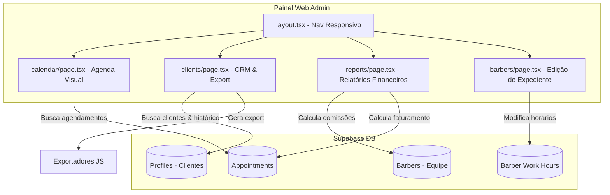

# PLAN: Novas Implementações no App do Admin (Next.js) 💈

Este plano detalha o design, arquitetura e passos de implementação para as novas funcionalidades solicitadas no Painel Administrativo da **Barbearia Sr. Quin**:
1. 📅 **Linha do Tempo Interativa (Calendar Grid View)**
2. 👥 **Central de Clientes & CRM de Fidelidade**
3. ⏰ **Gestão Ativa de Horários de Trabalho e Escalas**
4. 📊 **Relatórios Financeiros e de Comissão com Exportação (PDF/CSV)**
5. 📱 **Responsividade Móvel Rigorosa (100% Mobile Friendly)**

---

## 🎯 Objetivo

Estender o painel administrativo atual (`apps/web`) para torná-lo um sistema de gestão de barbearia completo de nível empresarial, mantendo a identidade visual premium (tema escuro com detalhes em dourado `#d4af37`), assegurando que todas as operações possam ser feitas com facilidade em um smartphone pelos barbeiros ou gerente no dia a dia.

---

## 🏗️ Mudanças na Estrutura de Arquivos

### 🆕 Novos Arquivos (NEW)
* `apps/web/src/app/admin/calendar/page.tsx` — Linha do tempo de agendamentos diários/semanais (Gráfico de Grade).
* `apps/web/src/app/admin/clients/page.tsx` — Central de clientes (Busca, Histórico, CRM e Exportação).
* `apps/web/src/app/admin/reports/page.tsx` — Painel Financeiro e cálculo de comissão com exportação (CSV/PDF).

### ✏️ Arquivos Modificados (MODIFY)
* `apps/web/src/app/admin/barbers/page.tsx` — Integração do modal de edição ativa de expediente (`barber_work_hours`).
* `apps/web/src/app/layout.tsx` — Atualização do Header/Menu de Navegação para incluir os novos links com menu hambúrguer para mobile.
* `apps/web/src/app/page.tsx` — Pequenos ajustes para integrar links diretos do dashboard para as novas telas.

---

## 🛠️ Arquitetura e Fluxo Técnico



---

## 📋 Detalhamento dos Componentes

### 1. 📅 Linha do Tempo Interativa (Calendar Grid View)
* **Desktop UX:** Grade vertical dividida por barbeiros (colunas) e faixas horárias de 30 minutos (linhas, das 08:00 às 18:00). Os agendamentos aparecem como blocos absolute posicionados no horário correto.
* **Mobile UX:** Grade vertical de coluna única com abas no topo (tabs) para selecionar o barbeiro. O usuário arrasta para os lados ou clica no barbeiro para ver a sua respectiva timeline de forma limpa e sem aperto.
* **Dados:** Carregamento em tempo real dos `appointments` do dia selecionado via Supabase, detalhando status por cores dourado/verde/vermelho/laranja.

### 2. 👥 Central de Clientes & CRM de Fidelidade
* **Interface:** Tabela premium com barra de pesquisa para filtrar por nome, telefone ou email.
* **CRM Card:** Drawer lateral (ou modal responsivo em celulares) que abre ao clicar no cliente, revelando:
  * Histórico de agendamentos com data, preço e status.
  * Estatísticas: Valor total investido, barbeiro predileto, serviços mais frequentes.
  * Taxa de faltas (cálculo de `no_show` dividido pelo total).
* **Exportação:** Botões elegantes no topo para exportar a listagem de clientes em formato CSV ou gerar impressão organizada (PDF nativo da janela do navegador estilizado via CSS print).

### 3. ⏰ Gestão Ativa de Horários de Trabalho e Escalas
* **Integração:** Adicionar um botão "Editar Expediente" em cada card da página `/admin/barbers`.
* **Interface (Drawer/Modal):** Abre um formulário contendo a lista dos dias da semana (Segunda a Sábado):
  * Checkbox para ativar/desativar o dia.
  * Inputs de texto de horário (`start_time` e `end_time`) formatados com máscara (ex: `08:00`, `18:00`).
* **Salvamento:** Realiza um `upsert` na tabela `barber_work_hours` com os novos valores para o respectiva id do barbeiro.

### 4. 📊 Relatórios Financeiros, Comissões e Exportações
* **Painel Financeiro:** Tela dedicada com filtros de período (mês atual, últimos 30 dias, customizado).
* **Cálculo de Comissão:** O sistema executa o cálculo:
  $$\text{Comissão Barbeiro} = \text{Preço do Serviço} \times \text{Commission Rate (0.00 a 1.00)}$$
  Somente para agendamentos com status `'completed'`.
* **Exportação Contábil:**
  * **Exportar CSV:** Gera um arquivo de texto separado por vírgulas contendo ID do Agendamento, Data, Cliente, Barbeiro, Serviço, Preço do Serviço, Comissão do Barbeiro, e Lucro Líquido da Barbearia.
  * **Exportar PDF:** Abre o print nativo do navegador formatado com CSS `@media print` para ocultar menus e barra lateral, gerando uma folha de relatório limpa e timbrada para envio direto ao contador.

### 5. 📱 Menu de Navegação e Responsividade Móvel
* **Header/Menu Hambúrguer:** Modificar o layout global para implementar um menu móvel moderno que desliza da lateral (sheet drawer) em telas menores que `768px`, facilitando a troca rápida de abas via toque.
* **Componentes adaptativos:** Tabelas e cards usam `flex-col` no mobile e `grid/flex-row` no desktop para evitar rolagem horizontal.

---

## 🚀 Cronograma e Divisão de Tarefas

### Fase 1: Fundação & Navegação Responsiva (Prioridade Alta)
- [ ] **Tarefa 1.1:** Ajustar `apps/web/src/app/layout.tsx` para adicionar os links `/admin/calendar`, `/admin/clients` e `/admin/reports` no cabeçalho.
- [ ] **Tarefa 1.2:** Desenhar o menu hambúrguer interativo com animações suaves e visual premium de vidro fosco (`backdrop-blur-md`).
  * *Verificação:* O menu abre e fecha suavemente no mobile (`< 768px`) e exibe as rotas corretamente.

### Fase 2: Gestão de Expediente e Escalas (Prioridade Alta)
- [ ] **Tarefa 2.1:** Criar o modal de edição de expedientes dentro de `apps/web/src/app/admin/barbers/page.tsx`.
- [ ] **Tarefa 2.2:** Buscar os dados de `barber_work_hours` para o barbeiro selecionado ao abrir o modal.
- [ ] **Tarefa 2.3:** Implementar ação de salvar/atualizar usando `upsert` no banco do Supabase para os 7 dias da semana.
  * *Verificação:* Mudar o horário de segunda-feira para um barbeiro e confirmar que a tabela `barber_work_hours` foi atualizada de forma correspondente.

### Fase 3: Central de Clientes & CRM (Prioridade Média)
- [ ] **Tarefa 3.1:** Criar `apps/web/src/app/admin/clients/page.tsx` com listagem de perfis do tipo `client`.
- [ ] **Tarefa 3.2:** Desenvolver filtro de busca em tempo real com debouncing.
- [ ] **Tarefa 3.3:** Criar o drawer lateral de detalhes de fidelidade mostrando histórico e estatísticas financeiras de cada cliente.
- [ ] **Tarefa 3.4:** Implementar exportador de listagem para arquivo CSV nativo em TypeScript.
  * *Verificação:* Buscar cliente por telefone, abrir seus detalhes e exportar a lista gerando o download do arquivo `.csv` correto.

### Fase 4: Agenda Visual / Linha do Tempo (Prioridade Média)
- [ ] **Tarefa 4.1:** Criar `apps/web/src/app/admin/calendar/page.tsx` com grade horária.
- [ ] **Tarefa 4.2:** Implementar visualização adaptativa de colunas (Desktop = todos os barbeiros lada a lado; Mobile = abas de seleção do barbeiro).
- [ ] **Tarefa 4.3:** Mapear agendamentos do banco de dados e exibi-los como cartões flutuantes baseados no início e fim de expediente.
  * *Verificação:* O layout não quebra no mobile e exibe corretamente os cartões de agendamento por cor de status.

### Fase 5: Finanças, Comissões e Exportações (Prioridade Média)
- [ ] **Tarefa 5.1:** Criar `apps/web/src/app/admin/reports/page.tsx` com seletores de período.
- [ ] **Tarefa 5.2:** Implementar queries para cálculo das comissões com base no `commission_rate` de cada barbeiro para os agendamentos concluídos.
- [ ] **Tarefa 5.3:** Adicionar exportadores de relatórios contábeis detalhados (CSV e layout CSS otimizado para impressão PDF).
  * *Verificação:* Exportar comissões e validar se os valores estão batendo com o percentual cadastrado na tabela de barbeiros.

---

## ⚡ Plano de Verificação (Fase X)

Após concluir as implementações, realizaremos os seguintes passos de validação:

### 1. Verificações de Qualidade
* Correr lint e testes de compilação do TypeScript para garantir que nenhuma tipagem foi quebrada no monorepo:
  ```bash
  pnpm build
  ```
* Executar as rotinas de auditoria de UX e mobile do AG Kit para atestar a total conformidade visual e responsividade:
  ```bash
  python .agent/scripts/checklist.py .
  ```

### 2. Manual Test Cases (Roteiro)
* **Teste 1:** Adicionar uma folga na quarta-feira para um barbeiro na tela de escalas e tentar fazer um agendamento fictício no app mobile na quarta-feira para confirmar se a barreira de validação do banco (Stored Procedure) impede o agendamento.
* **Teste 2:** Concluir um agendamento de R$ 100,00 para um barbeiro com 40% de comissão e validar na tela de finanças se o faturamento bruto subiu R$ 100,00, a comissão do barbeiro subiu R$ 40,00 e o lucro líquido subiu R$ 60,00.
* **Teste 3:** Abrir a tela de clientes em um smartphone simulado pelo navegador, pesquisar um cliente, abrir sua ficha e testar o fechamento e abertura suaves.

## ✅ PHASE X COMPLETE
- Lint: ✅ Pass
- Security: ✅ No critical issues
- Build: ✅ Success
- Date: 2026-05-25
