# PLAN: Estruturação de Monorepo com Turborepo e pnpm 🚀

Este plano detalha as etapas para estruturar a arquitetura do projeto **BarbeariaApp** como um monorepo moderno e de alto desempenho utilizando **Turborepo** e **pnpm**.

---

## 1. Visão Geral do Monorepo

O monorepo abrigará o ecossistema completo da Barbearia:
```text
barbearia-monorepo/
├── apps/
│   ├── web/          # Painel Web/Admin (Next.js + Tailwind + shadcn/ui)
│   └── mobile/       # App do Cliente (Expo + NativeWind/Gluestack)
├── packages/
│   ├── shared/       # Tipos, Schemas Zod, e Utilitários de Data/Hora (Rondônia)
│   ├── tsconfig/     # Configurações TypeScript globais e reutilizáveis
│   └── tailwind/     # Configuração de design token comum para Web e Mobile
├── package.json      # Configurações de workspace raiz
├── pnpm-workspace.yaml
└── turbo.json        # Configuração de cache do Turborepo
```

---

## 2. Requisitos & Pré-requisitos (Ações do Usuário)

> [!IMPORTANT]
> Para darmos início à criação, certifique-se de que possui as ferramentas de ambiente instaladas na sua máquina.
>
> 1. **Instalar o `pnpm` globalmente:**
>    Se ainda não possuir o `pnpm`, execute no terminal:
>    ```bash
>    npm install -g pnpm
>    ```
> 2. **Instalar a CLI do Supabase localmente:**
>    O plano prevê a instalação da Supabase CLI como dependência de desenvolvimento no monorepo para geração automática dos tipos em TypeScript, sem necessidade de instalação global.

---

## 3. Cronograma de Tarefas (Fase por Fase)

```mermaid
gantt
    title Cronograma de Implantação do Monorepo
    dateFormat  X
    axisFormat %d
    section Fase 1
    Configurar Estrutura Raiz    :active, 0, 10
    section Fase 2
    Criar app Web (Next.js)      : 10, 20
    section Fase 3
    Criar app Mobile (Expo)      : 20, 30
    section Fase 4
    Criar Pacote Compartilhado   : 30, 40
    section Fase 5
    Puxar Tipos e Testar Build   : 40, 50
```



### Fase 1: Setup do Workspace Raiz (Turborepo & pnpm)
*   Criar o arquivo `pnpm-workspace.yaml`.
*   Criar o `package.json` na raiz com as dependências do Turborepo.
*   Criar o `turbo.json` configurando os pipelines de `build`, `lint` e `dev`.
*   Instalar a CLI do Supabase como dependência de desenvolvimento raiz.

### Fase 2: Painel Web (Next.js + Tailwind + shadcn/ui)
*   Inicializar o app Next.js 14+ em `apps/web` no modo não interativo.
*   Configurar o Tailwind CSS em `apps/web`.
*   Instalar e inicializar o `shadcn/ui` para os componentes visuais premium.

### Fase 3: App Mobile (Expo + Gluestack UI / Tailwind)
*   Inicializar o projeto Expo em `apps/mobile`.
*   Configurar a integração básica de estilos (estilo Tailwind-like).
*   Instalar o SDK oficial do Supabase (`@supabase/supabase-js`) e `secure-store` para autenticação segura.

### Fase 4: Pacote Shared (`packages/shared`)
*   Criar a estrutura do pacote `@barbearia/shared`.
*   Estruturar os diretórios internos:
    *   `/types`: Onde residirá o `database.types.ts`.
    *   `/schemas`: Validadores Zod para formulários comuns (cadastro, agendamentos).
    *   `/utils`: Formatadores e lógica de conversão de fuso horário específica de Rondônia (`America/Porto_Velho`).

### Fase 5: Integração de Tipos e Build Final
*   Autenticar na CLI do Supabase localmente.
*   Puxar o esquema do banco de dados para gerar automaticamente o arquivo `database.types.ts`.
*   Testar a orquestração do Turborepo rodando `pnpm build` a partir da raiz para compilar todo o ecossistema simultaneamente.

---

## 4. Plano de Verificação

### Testes Automatizados de Orquestração
*   **Comando:** `pnpm install` na raiz (deve instalar todas as dependências das apps e pacotes compartilhados sem erros).
*   **Comando:** `pnpm build` (o Turborepo deve compilar tanto a Web quanto o pacote Shared com sucesso).

### Verificação Manual
*   Iniciar o ambiente de desenvolvimento local:
    ```bash
    pnpm dev
    ```
*   Verificar se o Next.js carrega na porta `3000` e se o servidor do Expo (Metro bundler) inicializa corretamente.
